# PhishingLab-CTF-N1
This Capture The Flag exercise of medium difficulty focuses on phishing detection and analysis using VirusTotal and URLscan. I had to identify phishing artifacts, analyze malicious URLs/files. This includes a step-by-step walkthrough and solutions.

**Disclaimer:** This is from an expired Cyberdefenders phishing Lab.

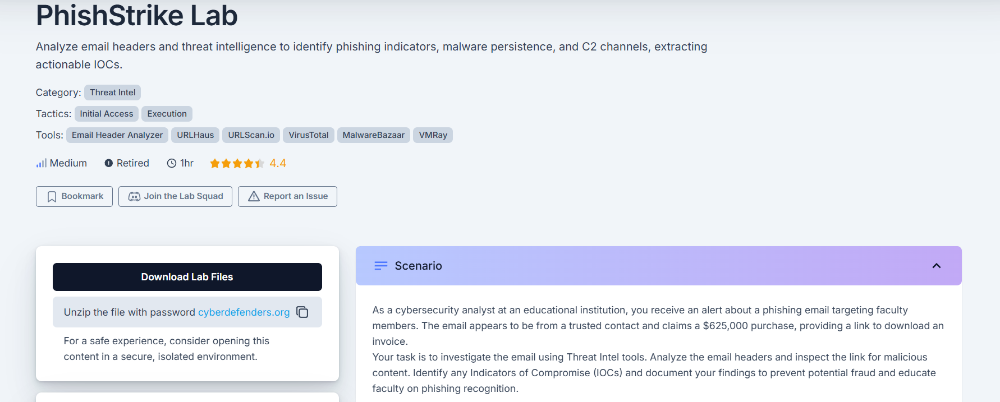 
There is a file to download. For security reasons, I used my Kali Linux VM to open and run the mail attached to this lab

### Question 1
Identifying the sender's IP address with specific SPF and DKIM values helps trace the source of the phishing email. What is the sender's IP address that has an SPF value of softfail and a DKIM value of fail?

The question gives hints at where to find the IP address. With very little research, I was able to find the IP.
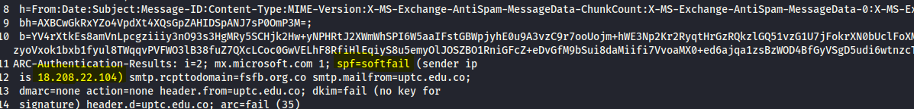 

### Question2
Understanding the return path of an email is essential for tracing its origin. What is the return path specified in this email?

**Answer:**
I simply used `CTRL-F` to search for keywords like "Return" in suspicious mail.
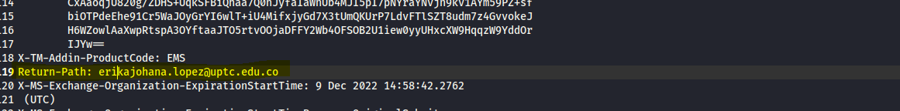 

### Question 3 :
Identifying the source of malware is critical for effective threat mitigation and response. What is the IP address of the server hosting the malicious file related to malware distribution? 

**Answer:**
Here, I had to look through the mail. Around the body, I found another IP address that turned out to be the server
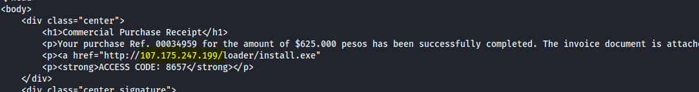

### Question 4:
Identifying malware that exploits system resources for cryptocurrency mining is critical for prioritizing threat mitigation efforts. The malicious URL can deliver several malware types. Which malware family is responsible for cryptocurrency mining?

**Answer:**
Considering I found the server IP, I looked it up on VirusTotal. In the community section, I found the malware's name.
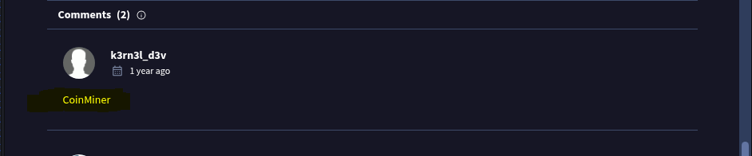

### Question 5:
Identifying the specific URLs malware requests is key to disrupting its communication channels and reducing its impact. Based on the previous analysis of the cryptocurrency malware sample, what does this malware request the URL?

**Answer:**
This question was a little tricky and took me the most time to find. I did my research on Urlscna.io and TotalVirus but wasn't able to get the answer. I later on used URLhaus.abuse.ch. I was able to retrieve the SHA256 of malware CoinMiner

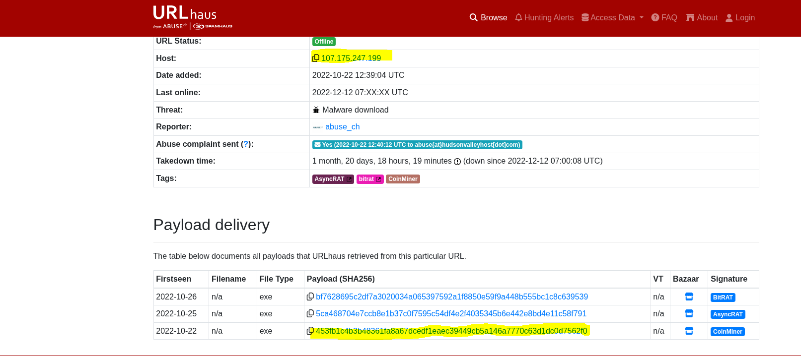

With this SHA256, I returned on VirusTotal and was able to get my answer.
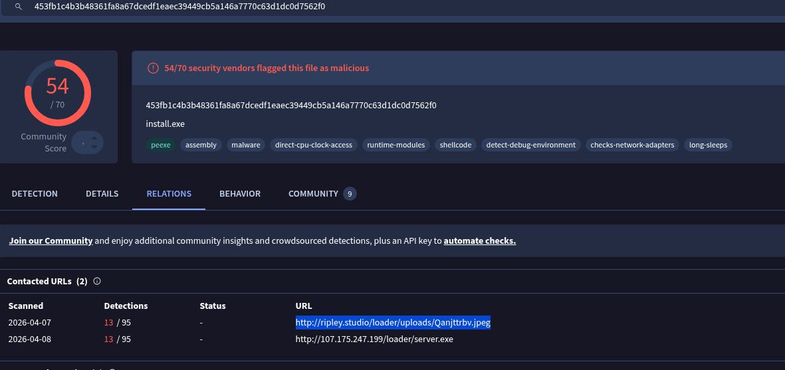

### Question 6:
Understanding the registry entries added to the auto-run key by malware is crucial for identifying its persistence mechanisms. Based on the BitRAT malware sample analysis, what is the executable's name in the first value added to the registry auto-run key?

**Answer:**
I visited the "detail" section. The answer was there
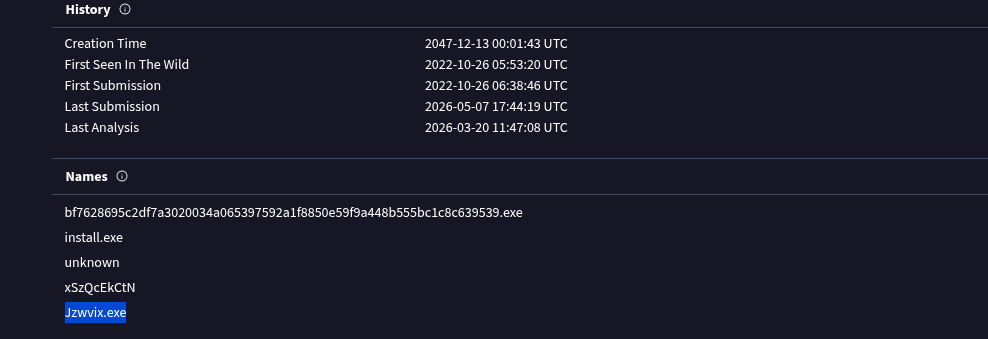

### Question 7:
Identifying the SHA-256 hash of files downloaded from a malicious URL is essential for tracking and analyzing malware activity. Based on the BitRAT analysis, what is the SHA-256 hash of the file previously downloaded and added to the autorun keys?

**Answer:**
I simply had to return to  URLhaus.abuse.ch. The answer is the SHA256 you find with the BitRat Signature. I also used VirusTotal but that isn't necessary.

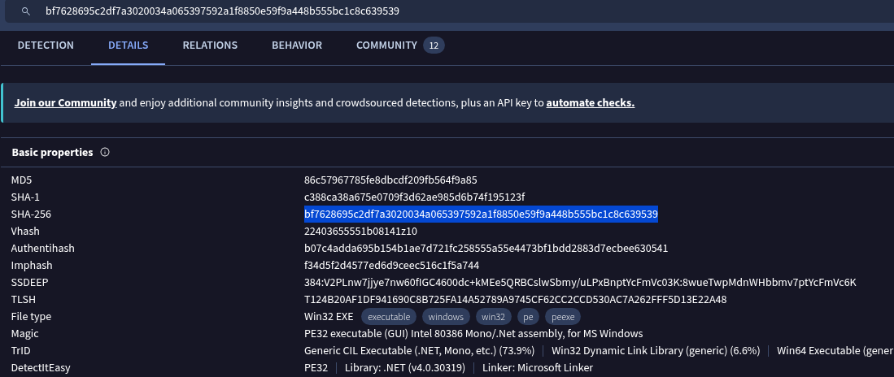

### Question 8:
Analyzing the HTTP requests made by malware helps in identifying its communication patterns. What is the URL in the HTTP request used by the loader to retrieve the BitRAT malware?

**Answer:**
The HTTP request is found in the Behavior section

### Question 9:
Introducing a delay in malware execution can help evade detection mechanisms. What is the delay (in seconds) caused by the PowerShell command according to the BitRAT analysis?

**Answer:**
Still on the "Behavior" Section, I went lower to the webshell. I found a suspicious base64 encoding. After decoding, I was able to have the answer: 50 seconds
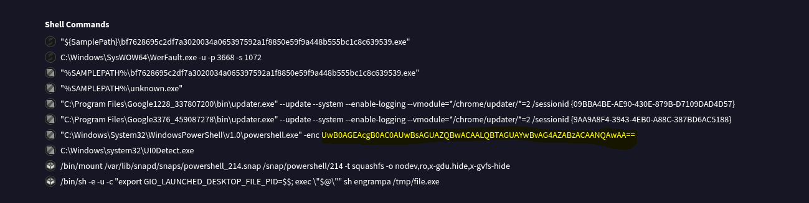

### Question 10:
Tracking the command and control (C2) domains used by malware is essential for detecting and blocking malicious activities. What is the C2 domain used by the BitRAT malware?

**Answer:**
The answer was in the "Community" section of VirusTotal
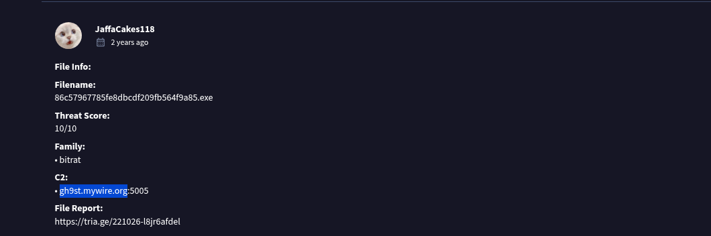

### Question 11:
Understanding how malware exfiltrates data is essential for detecting and preventing data breaches. According to the AsyncRAT analysis, what is the Telegram Bot ID used by this malware?

**Answer:**
I returned once more to URLhaus.abuse.ch. and selected AsyncRAT SHA256 and pasted it in VirusTotal. Once more in the "community" section, I found a few reports. selected the Hatching report. There was my answer.

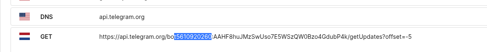

### Skills Gained
- Phishing email analysis
- Indicator of Compromise (IOC) identification
- VirusTotal workflow & interpretation
- Threat hunting methodology

